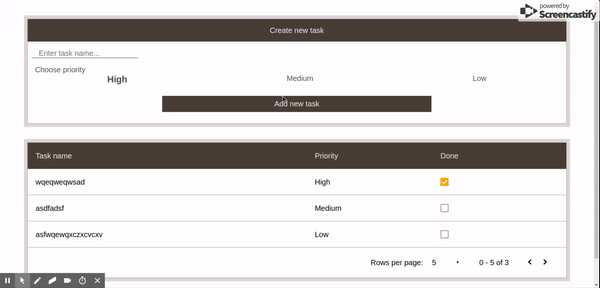

# custom-task-manager

This is a implementation of simple UI list which show a TODO list. 

You can easily use it to manage your time by planning what you have to do. 

List have a nice UI with basic functions: sort functions, pagination, adding and delteting task and storing todos in localstorage.

## Tech

- ReactJS
- CSS

## How to install or watch app

You can easily click on the [LINK](http://custom-todo-app.surge.sh/) or you can watch my app on your localhost
you will need node environment and npm on your machine and web browser (CHROME)

Install the dependencies and start the server.

in folder with downloaded project in terminal you have to type

```sh
$ npm install
$ npm start
```

## HOW IT WORKS



### TODO

- improve and refactor CSS

